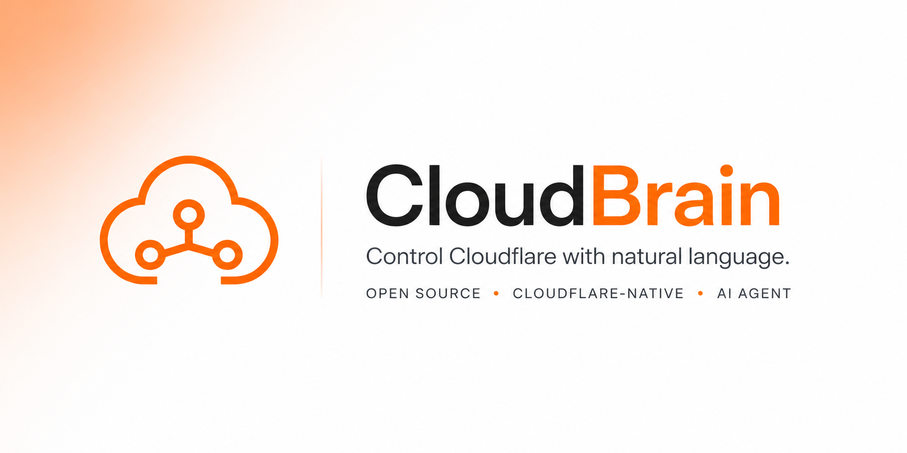

# CloudBrain 🧠☁️



An AI agent running on **Cloudflare Workers**, controlled via **Telegram**, with native access to Cloudflare services via API.

## Features

✅ **Serverless Infrastructure** — Runs entirely on Cloudflare Workers (no VPS, no ops)  
✅ **AI-Powered** — Uses Cloudflare Workers AI through the `AI` binding  
✅ **Telegram Interface** — Full natural language chat via Telegram  
✅ **Context Caching** — KV namespace for session/context storage with auto-eviction  
✅ **API Access** — Full access to D1, R2, Workers, and Cloudflare services via API  
✅ **Dynamic Automations** — Create and deploy worker scripts for scheduled/triggered tasks  
✅ **Multi-Model AI** — Mistral (text), Whisper (audio), Stable Diffusion (images)  
✅ **Self-Hosted** — Deploy to your own Cloudflare account  
✅ **Type-Safe** — Full TypeScript support  

## Quick Overview

CloudBrain is a personal AI assistant that lives on Cloudflare Workers. It uses:
- **2 Bindings**: Workers AI (`AI`) and KV Cache (`KV`)
- **4 Credentials**: Telegram bot token, your Telegram ID, Cloudflare API token, Cloudflare account ID
- **API Access**: Manages D1 databases, R2 buckets, and Workers via Cloudflare API

You send natural language commands via Telegram, and it:
- **Answers questions** using Mistral LLM
- **Generates images** via Stable Diffusion
- **Transcribes audio** via Whisper
- **Stores data** in D1 database (via API)
- **Manages files** in R2 buckets (via API)
- **Creates automations** (dynamic workers with cron schedules)
- **Caches context** in KV with automatic eviction

---

## 🏗️ Architecture

### Bindings (2 Total)
- **`AI`** — Workers AI binding for Claude API inference
- **`KV`** — KV namespace for context storage (8-12 KB per request, FIFO eviction when limit exceeded, no TTL)

### Credentials (Manual - Set in Dashboard)
1. **TELEGRAM_BOT_TOKEN** — from @BotFather
2. **TELEGRAM_OWNER_ID** — from @userinfobot
3. **CLOUDFLARE_API_TOKEN** — from Cloudflare Dashboard
4. **CLOUDFLARE_ACCOUNT_ID** — from Cloudflare Dashboard

### Services (Accessed via API)
- **D1** — Persistent database for users, messages, automations
- **R2** — Object storage for files and outputs
- **Workers** — Dynamic worker creation for automations

---

## 🚀 Quick Start

**CloudBrain needs only 4 environment credentials:**

1. **TELEGRAM_BOT_TOKEN** — from @BotFather
2. **TELEGRAM_OWNER_ID** — from @userinfobot
3. **CLOUDFLARE_API_TOKEN** — from Cloudflare Dashboard
4. **CLOUDFLARE_ACCOUNT_ID** — from Cloudflare Dashboard

### Deployment Steps

1. **Create KV Namespace** (one-time setup):
   ```bash
   wrangler kv:namespace create cloudbrain
   ```
   This creates the namespace that stores conversation context with FIFO eviction (8-12 KB limit, no TTL).

2. **Deploy Worker**:
   ```bash
   npm run deploy
   ```

3. **Configure Bindings in Cloudflare Dashboard**:
   - Go to [Cloudflare Dashboard](https://dash.cloudflare.com)
   - Navigate to **Workers & Pages** → **cloudbrain** → **Settings** → **Bindings**
   - Add **Workers AI Binding**: Name = `AI`, Type = `AI`
   - Add **KV Namespace Binding**: Name = `KV`, Type = `KV Namespace`, Select = `cloudbrain`

4. **Set Environment Variables** in Cloudflare Dashboard → **Settings** → **Variables**:
   - `TELEGRAM_BOT_TOKEN` (Secret)
   - `TELEGRAM_OWNER_ID` (Variable)
   - `CLOUDFLARE_ACCOUNT_ID` (Variable)
   - `CLOUDFLARE_API_TOKEN` (Secret)

5. **Setup Telegram Webhook**:
   ```bash
   curl -X POST https://api.telegram.org/bot<TELEGRAM_BOT_TOKEN>/setWebhook \
     -H "Content-Type: application/json" \
     -d '{"url":"<WORKER_URL>/webhook/telegram"}'
   ```
   Replace `<TELEGRAM_BOT_TOKEN>` with your token and `<WORKER_URL>` with your worker URL.

6. **Test**:
   - Open Telegram
   - Send `/start` to your bot
   - Send `/help` to see commands
   - Try `/ping` to test connection

👉 **[See Complete Step-by-Step Guide →](./SETUP.md)**

---

## Commands

All commands are **owner-only** (only your Telegram ID can use them).

| Command | Example | Purpose |
|---------|---------|---------|
| `/start` | `/start` | Initialize & confirm owner |
| `/help` | `/help` | List all commands |
| `/models` | `/models` | View available AI models |
| `/storage` | `/storage` | List all R2 files |
| `/database` | `/database` | Show database tables |
| `/automations` | `/automations` | List all automations |
| `/create` | `/create hourly price check` | Create new automation |
| `/delete` | `/delete price-check` | Delete automation |
| `/status` | `/status` | Check worker health |
| `/ping` | `/ping` | Test connection |

### Or Just Chat Naturally

```
You: "How are you?"
CloudBrain: "I'm running great on Cloudflare Workers! How can I help?"

You: "Generate an image of a sunset"
CloudBrain: "🖼️ Image generated and saved to R2"

You: "What's in my storage?"
CloudBrain: "📁 Your Files: (lists all R2 files)"
```

---

## Storage & Context Management

### KV Context Cache
- **Purpose**: Store conversation context (no TTL, manual cleanup)
- **Context Limit**: 8-12 KB per request maximum
- **Eviction Strategy**: FIFO (First In, First Out) - oldest entries deleted when exceeding 12 KB
- **Single Binding**: `KV` namespace stores all context
- **Limit**: 1GB per namespace (plenty for context)
- **Implementation**: When context size exceeds 12 KB, oldest messages are automatically removed from the context array before storage

### D1 Database (via API)
- **Purpose**: Persistent storage for users, messages, automations
- **Access**: Via Cloudflare API using your credentials
- **Tables**: users, messages, automations, files, action_logs

### R2 Storage (via API)
- **Purpose**: File storage and outputs
- **Access**: Via Cloudflare API using your credentials
- **Bucket**: cloudbrain-files (created via API)

---

## Environment Variables Reference

### Required (Set in Cloudflare Dashboard)

| Variable | Source | Type |
|----------|--------|------|
| `TELEGRAM_BOT_TOKEN` | @BotFather on Telegram | Secret |
| `TELEGRAM_OWNER_ID` | @userinfobot on Telegram | Variable |
| `CLOUDFLARE_API_TOKEN` | Cloudflare Dashboard > API Tokens | Secret |
| `CLOUDFLARE_ACCOUNT_ID` | Cloudflare Dashboard > Account Home | Variable |

### Bindings (Set in Cloudflare Dashboard)

| Binding | Type | Purpose |
|---------|------|---------|
| `AI` | Workers AI | Claude API for agent responses |
| `KV` | KV Namespace | Context storage (8-12 KB per request, FIFO eviction) |

---

## Development

### Local Testing

```bash
# Start dev server
npm run dev
```

Worker runs at `http://localhost:8787`

Test webhook:

```bash
curl -X POST http://localhost:8787/webhook/telegram \
  -H "Content-Type: application/json" \
  -d '{
    "update_id": 1,
    "message": {
      "message_id": 1,
      "date": 1234567890,
      "chat": { "id": 123, "type": "private" },
      "from": { "id": 456, "is_bot": false, "first_name": "Test" },
      "text": "Hello CloudBrain"
    }
  }'
```

### Type Checking

```bash
npm run type-check
```

### Deployment

```bash
npm run deploy
```

---

## Troubleshooting

### Worker not responding

Check logs:

```bash
wrangler tail
```

### Telegram webhook issues

Verify webhook is registered:

```bash
curl https://api.telegram.org/bot<TOKEN>/getWebhookInfo
```

### KV access issues

Verify binding name in code matches `wrangler.toml`:

```bash
grep -r "env.KV" src/
```

Should show references to `env.KV`.

---

## Performance

- **Latency**: <100ms typically (Cloudflare edge network)
- **AI Inference**: 2-10s depending on model & input
- **KV Access**: <50ms
- **API Calls**: <500ms

---

## Limits & Quotas

| Resource | Limit | Notes |
|----------|-------|-------|
| Worker CPU Time | 30s per request | Usually not hit |
| KV Storage | 1GB | Per namespace |
| R2 Storage | Pay-per-GB | $0.015/GB/month |
| AI Requests | 100k/day | Free tier |
| Message Size | 25MB | Telegram limit |

---

## AI Models Available

All via Cloudflare Workers AI:

### Text Generation
- `@cf/mistral/mistral-7b-instruct-v0.2` — Fast, multilingual

### Audio (Speech-to-Text)
- `@cf/openai/whisper` — Convert audio to text

### Image (Text-to-Image)
- `@cf/stabilityai/stable-diffusion-xl-generate` — Generate images

---

## License

MIT License — See [LICENSE](./LICENSE) file

---

## Support

- **Bugs**: Open an issue on GitHub
- **Questions**: Check README sections above
- **Feature Requests**: Discussions tab on GitHub

---

**CloudBrain** — Your personal AI infrastructure on Cloudflare. Serverless, scalable, and simple. 🚀
